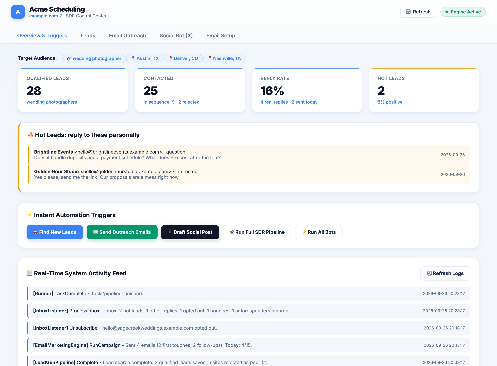

# Automated SDR by Fred

**Your AI sales rep: finds your ideal clients, emails them, and handles the replies.**

A free, open-source sales development rep (SDR) that runs on your own computer and sends from your
own mailbox. You tell it who your ideal client is. It finds those businesses, emails them a short,
human-sounding sequence, reads every reply, and hands you the people who are interested.

[](https://github.com/Fred-In-tech/automated-sdr-agent/actions/workflows/tests.yml)
[](LICENSE)
[](https://www.python.org/downloads/)




<sub>The dashboard with demo data. Yours shows your own business, logo, colours and leads.</sub>

**Install on macOS or Linux** (Terminal):

```bash
curl -fsSL https://raw.githubusercontent.com/Fred-In-tech/automated-sdr-agent/main/install.sh | bash
```

**Install on Windows** (PowerShell):

```powershell
irm https://raw.githubusercontent.com/Fred-In-tech/automated-sdr-agent/main/install.ps1 | iex
```

Then answer a few questions, which takes about 5 minutes. [More about installing ↓](#install-in-one-line)

---

**Contents:** [What it does](#what-it-does) · [Install](#install-in-one-line) ·
[Setup](#the-5-minute-setup) · [AI agents](#let-an-ai-agent-set-it-up) · [Daily use](#daily-use) ·
[Sales vs marketing emails](#sales-vs-marketing-emails) · [Lead search](#where-leads-come-from) ·
[Updates](#updates) · [Security & privacy](#security--privacy) · [Play by the rules](#play-by-the-rules) ·
[Configuration](#configuration-reference) · [Troubleshooting](#troubleshooting) ·
[Contributing](#contributing)

## What it does

- **Finds and qualifies leads.** It searches the web for the job titles and cities you choose (and,
  optionally, Thumbtack for US service businesses), then reads each business's own website. Every
  lead gets a **0–100 fit score with reasons**. Poor fits are saved as disqualified and never emailed.
- **Runs a follow-up sequence.** A first email and up to 3 follow-ups in the same thread (days 0,
  3, 7 and 14), best fits first. Anyone who replies, bounces or unsubscribes is taken out.
- **Works your inbox like an SDR.** It sorts every reply into *interested, question, not now, not
  interested, unsubscribe, wrong person* or *other*. Interested leads get a branded welcome email
  with your signup button, and **you get a hot-lead alert**. Out-of-office replies and newsletters
  are ignored, and your inbox is never marked as read.
- **Protects your sender reputation.** Daily limits, business hours only, a pause if bounces
  spike, and a do-not-contact list.
- **Learns what works.** Subject-line and signature A/B tests, UTM-tagged links for Google
  Analytics, and one polite check-in for leads who said "not now".
- **Reports.** A daily digest email, `sdr report`, and a local dashboard in your own brand colours
  and logo.
- **Optional AI.** With a Claude API key it writes a personal first line for each lead and reads
  replies more accurately.

Nothing about your business is hardcoded. Your targets and email wording live in one file,
`config/profile.toml`, which the setup writes for you.

## Install in one line

You need **git** and **Python 3.11 or newer**. If either is missing, the installer stops and shows
you the exact command to install it. It never uses `sudo` or admin rights.

| System | Open | Paste this |
|---|---|---|
| **macOS / Linux** | Terminal (Mac: press `⌘ Space`, type *Terminal*) | `curl -fsSL https://raw.githubusercontent.com/Fred-In-tech/automated-sdr-agent/main/install.sh \| bash` |
| **Windows 10/11** | PowerShell (Start menu, type *PowerShell*; no admin needed) | `irm https://raw.githubusercontent.com/Fred-In-tech/automated-sdr-agent/main/install.ps1 \| iex` |

The installer:

1. checks for git and Python 3.11+;
2. downloads the newest release into `~/automated-sdr` (Windows: `%USERPROFILE%\automated-sdr`),
   or moves an existing copy to it;
3. creates a private Python environment (`.venv`) so nothing else on your computer is affected;
4. adds the `sdr` command: macOS/Linux link it into `~/.local/bin`; Windows puts it in
   `%USERPROFILE%\.automated-sdr\bin` and adds that folder to your PATH;
5. starts `sdr setup`.

If a new terminal says `sdr: command not found`, see [Troubleshooting](#troubleshooting).

<details>
<summary><b>Installer options</b> (install somewhere else, skip setup, pick a Python)</summary>

Set these environment variables before running the installer:

| Variable | What it does | Default |
|---|---|---|
| `SDR_HOME` | Install folder | `~/automated-sdr` (Windows: `%USERPROFILE%\automated-sdr`) |
| `SDR_REPO` | Git repository to install from | this repository |
| `SDR_PYTHON` | The Python 3.11+ to use | the first suitable one found |
| `SDR_BIN_DIR` | Where the `sdr` command goes (macOS/Linux only) | `~/.local/bin` |
| `SDR_NO_SETUP=1` | Install only; run `sdr setup` yourself later | off |

```bash
curl -fsSL https://raw.githubusercontent.com/Fred-In-tech/automated-sdr-agent/main/install.sh | SDR_NO_SETUP=1 SDR_HOME=~/tools/sdr bash
```

```powershell
$env:SDR_NO_SETUP = '1'; irm https://raw.githubusercontent.com/Fred-In-tech/automated-sdr-agent/main/install.ps1 | iex
```

**Want to read the installer first?** Good instinct:

```bash
curl -fsSL https://raw.githubusercontent.com/Fred-In-tech/automated-sdr-agent/main/install.sh -o install.sh
less install.sh
bash install.sh
```

</details>

<details>
<summary><b>Manual install with git</b> (for developers)</summary>

```bash
git clone https://github.com/Fred-In-tech/automated-sdr-agent.git ~/automated-sdr
cd ~/automated-sdr
python3 -m venv .venv
.venv/bin/pip install -r requirements.txt
bin/sdr setup
```

Windows (PowerShell):

```powershell
git clone https://github.com/Fred-In-tech/automated-sdr-agent.git $env:USERPROFILE\automated-sdr
cd $env:USERPROFILE\automated-sdr
py -3 -m venv .venv
.venv\Scripts\pip install -r requirements.txt
bin\sdr.cmd setup
```

`bin/sdr` always uses the project's `.venv`. To type just `sdr`, link it onto your PATH, for
example `ln -s ~/automated-sdr/bin/sdr ~/.local/bin/sdr`. With the environment activated,
`python3 cli.py <command>` works too.

</details>

## The 5-minute setup

`sdr setup` starts with two short steps only you can answer: your business and your ideal
clients. Then it asks where you'd like to finish:

- **In your browser (easiest).** Your dashboard opens on its **Settings** page, with a checklist
  of what's left: connect your mailbox, set a password, turn on the schedule. Everything is a
  form with a Save button.
- **Here in the terminal.** The five remaining steps, below.

Closed the dashboard by mistake? Type `sdr dashboard` to open it again. You can change any
setting later on the same Settings page.

Most questions come with a suggestion you can accept with Enter; you type your website, mailing
address, ideal client, pitch, cities and mailbox login yourself. Arrow keys pick from menus.

| Step | What it asks |
|---|---|
| **1. Your business** | Your website. It reads your business name, tagline, logo and brand colour from it and asks "Use these?". Then what you offer new clients (e.g. *free 14-day trial*), the link for the "try it" button (defaults to your website), and your business mailing address (required by law in cold email). |
| **2. Your ideal clients** | Who they are in 1–3 words (e.g. *wedding photographer*), one line finishing "*Your business* helps *wedding photographers* …", the job titles to search for, and the cities (one per line, e.g. `Austin, TX`). Then how to search the web: Brave Search, DuckDuckGo, "decide for me" or Bing ([details](#where-leads-come-from)). |
| **3. Email style** | **Sales** (plain and personal, recommended) or **Marketing** (branded HTML). With sales emails (and a logo) you can A/B test a small logo in your signature. It also asks whether to send a branded welcome email when someone says "send me the link". |
| **4. Your email account** | Your sending address, the provider (guessed from the address), and the password or app password (hidden). It checks the login without sending anything, then emails you a 6-digit code to prove sending works. Then your first name for signing off, the sender name people see, and optionally an alias and a separate address for lead alerts. |
| **5. Replies** | Whether to answer interested leads automatically. It shows you the three replies it will use. |
| **6. Schedule** | A suggested schedule, for example *runs at 09:00 and 14:00 on weekdays, sends up to 10 emails a day, checks replies every 45 min, finds 4 new leads a run*. Keep it or change it, then choose whether to turn it on now. It stays off unless you say yes. |
| **7. Security & updates** | A dashboard password (recommended; only a hash is saved), and how updates work: notify you (default), install automatically, or off. |

You'll see a summary and "Save these settings?". After saving it offers to **send a sample
email to yourself**, **open your dashboard** and **find your first leads** (that search runs only
if you say yes, and it emails nobody).

To change something later, open the dashboard (`sdr dashboard`) and go to **Settings**.
In the terminal, running `sdr setup` again lets you change one part, go through everything again,
or leave it. To jump straight to one part, run `sdr setup --section <name>` with `brand`, `audience`, `style`,
`email`, `replies`, `schedule`, `security` or `updates`. Only that part changes; your hand-edited
email wording is kept.

## Let an AI agent set it up

Using Claude Code, Cursor, Codex, Copilot or Windsurf? Paste this into it:

> Install and set up https://github.com/Fred-In-tech/automated-sdr-agent for me. Follow its AGENTS.md.

[AGENTS.md](AGENTS.md) tells the agent exactly what to do.

1. It installs with `SDR_NO_SETUP=1`.
2. It asks you the setup questions in plain words (`sdr setup --print-questions` lists them).
3. It writes your answers to `setup-answers.toml`, which is git-ignored (like any `*answers*.toml`
   file) and **never contains a password**.
4. **You** type your mailbox password into your own terminal. The agent never sees it.
5. It runs `sdr setup --answers setup-answers.toml`, then `sdr doctor` and `sdr preview`.

Agents are told never to read `.env`, never to commit secrets or lead data, never to email anyone
but you, and never to turn on the schedule unless you say so.

## Daily use

Type **`sdr`** on its own for the home menu. It shows your status (leads in the pipeline, emails
sent today, hot leads, schedule on or off, whether an update is available) and a menu: open the
dashboard, run now, send yourself a sample, preview emails, change settings, turn the schedule on
or off, check for updates, run a health check.

| Command | What it does |
|---|---|
| `sdr` | Home menu: status plus the common actions |
| `sdr setup` | Setup wizard. `--section NAME` changes one part; `--answers FILE` and `--print-questions` are for AI agents |
| `sdr preview` | Shows every email of your sequence (to a made-up lead) and the web searches. **Sends nothing** |
| `sdr test-email` | Sends one real sample to your own mailbox. `--step 2` sends follow-up 1, `--reply interested` sends the welcome reply, `--signature logo` forces the logo signature, `--to` sends it somewhere else |
| `sdr dashboard` | Opens the dashboard in your browser (stays running until Ctrl+C). `--set-password`, `--no-open`, `--port N` |
| `sdr run` | Handles replies, finds new leads, emails them and sends the daily digest, right now. **Emails real prospects** |
| `sdr report` | Your pipeline: funnel, reply rate, A/B results, hot leads, follow-ups due. `sdr status` is the same |
| `sdr schedule on` / `sdr schedule off` / `sdr schedule status` | Runs automatically every day (cron on macOS/Linux, Task Scheduler on Windows), stops it, or shows it |
| `sdr update` | Installs the latest release with backup, self-test and automatic rollback. `--check` only checks |
| `sdr doctor` | Health check: Python, profile, email login, lead search, schedule, dashboard password, updates. `--online` also tests your Brave key; `--offline` skips the login check |
| `sdr open` | Shows where your files are and opens them: `sdr open profile`, `sdr open example`, `sdr open logs` |
| `sdr version` | Shows the version |

<details>
<summary><b>More commands</b> (run one part of the pipeline by hand)</summary>

| Command | What it does |
|---|---|
| `sdr leadgen` | Finds new leads only (`--count N`) |
| `sdr email` | Emails leads that are due only (`--limit N`). **Emails real prospects** |
| `sdr inbox` | Handles replies, bounces and unsubscribes only |
| `sdr pipeline` | Same as `sdr run` |
| `sdr run-all` | Same as `sdr run`, plus social drafts when `[social]` is enabled |
| `sdr social` | Drafts a social post (`--topic`). It never posts anything |
| `sdr digest` | Emails you the daily digest now (`--force` sends it even if it already went out today) |
| `sdr export` | Exports your leads to `data/leads_export.csv` |
| `sdr import FILE` | Imports your own leads from a CSV file with an `email` column, e.g. a file called leads.csv. Sends nothing. Options: `--dry-run` (only check), `--no-verify` (skip the mail-server check), `--template` (print an example file) |
| `sdr resume` | Starts sending again after a bounce-rate pause. The bounce limit stays the same |
| `sdr requalify` | Re-scores leads saved before fit scoring existed (`--dry-run` to preview) |

These print their result as JSON. `python3 cli.py <command>` is the same as `sdr <command>`.

</details>

Until your email login works, sending and reply handling run in **dry-run mode**: they show what
they would do and send nothing.

## Sales vs marketing emails

Where your email lands decides whether it gets read. Gmail and other inboxes sort mail into
**Primary** (personal mail, which people read and answer) and **Promotions** (newsletters and ads,
mostly skimmed). Designed, image-heavy emails look like marketing, so they tend to go to
Promotions.

| | **Sales outreach** (recommended) | **Marketing** |
|---|---|---|
| Looks like | An email you typed: plain text, your name, no links ("reply and I'll send you the link") | A designed email: your logo, brand colours, a button, feature pills |
| Usually lands in | Primary | Promotions |
| Best for | Cold email to people who don't know you yet | People who already know you, like newsletters and customers |
| Setup answer | `kind = "sales"` (profile: `style = "personal"`) | `kind = "marketing"` (profile: `style = "branded"`) |

- **Cold outreach should be sales style.** You want a reply, and replies come from Primary.
- **The welcome email can be branded either way.** When a lead says "send me the link" they
  asked for it, so the branded welcome (what they get, 3 steps to start, and a button like "Start your
  free 14-day trial") is fine. It's on by default (`[auto_reply] branded_intents = ["interested"]`).
- **Test a small signature logo.** With `signature_logo_test = true`, half your leads see your
  logo beside your name. `sdr report` shows which half replies more.
- **Always check before you send.** `sdr preview` shows the copy, and `sdr test-email` shows how it
  really looks in your inbox. Both styles also send a plain-text version.

Nothing can guarantee the Primary tab. Sending from your own domain, warming up slowly (see
[sending limits](#play-by-the-rules)) and keeping emails short and personal all help.

## Where leads come from

Lead search uses one web search engine, chosen in setup (`sdr setup --section audience`) or in
`config/profile.toml` as `[targeting] search_engine`.

| Engine | Setting | Key | Good to know |
|---|---|---|---|
| **Brave Search** (recommended) | `"brave"` | Free API key from [brave.com/search/api](https://brave.com/search/api/) | The official API, so it's the most reliable. The free plan allows about one search a second plus a monthly total. The key is saved in `.env` as `BRAVE_API_KEY`. |
| **DuckDuckGo** | `"duckduckgo"` | None | Used by default when you have no Brave key. It searches slowly on purpose (one search every 2 seconds). If you search a lot, DuckDuckGo may ask "are you human?". Lead search then stops for that run and tries again next run. |
| **Bing** (not recommended) | `"bing"` | None | Bing's robots.txt tells bots not to use its search pages, so this breaks Bing's rules and Bing may block you. It only runs if you pick it explicitly, and every run logs a warning. |
| **Decide for me** | `"auto"` (default) | None | Brave when `BRAVE_API_KEY` is set, otherwise DuckDuckGo. Never Bing. |

`sdr doctor` shows which engine is active, and `sdr doctor --online` checks your Brave key with one
test search. For US cities written as `City, ST`, it can also read Thumbtack listings: set
`thumbtack_categories` in `config/profile.toml`. Prospects' own websites are only read where their
robots.txt allows it.

## Updates

Installed copies update to **release tags** (`v1.0.0`, `v1.1.0`, …) from the repository you
installed from. They never jump to unreleased code.

| `[updates] mode` | What happens |
|---|---|
| `"notify"` (default) | Checks every Monday at 08:30 (while the schedule is on). "Update available" then shows in your daily digest, the dashboard and the `sdr` menu. You install it with `sdr update`. |
| `"auto"` | The same weekly check also installs new releases, waiting for any running pipeline to finish first. |
| `"off"` | Never checks. |

**What `sdr update` does**

1. It checks for a release and shows what's new (from `CHANGELOG.md`), then asks before
   installing. `sdr update --check` only checks.
2. It backs up your database, profile, `.env` and do-not-contact list to
   `data/backups/<timestamp>/`. The newest 5 backups are kept.
3. It moves forward to the release (a git fast-forward, never a merge over your own commits),
   reinstalls the requirements, and runs the self-tests.
4. **If anything fails, it rolls back automatically** to exactly the version you had.

If you've edited project files, the update stops rather than overwrite them. `sdr update --force`
saves your edits as `local-changes.patch` in the backup folder, then updates.

**Undoing an update by hand.** Your data isn't tracked by git, so going back to an earlier release
leaves it alone. This does throw away any edits you made to the project's own files:

```bash
cd ~/automated-sdr && git reset --hard v1.0.0 && .venv/bin/pip install -r requirements.txt
```

To restore data from a backup, copy the files from `data/backups/<timestamp>/` back into the
install folder. The paths inside the backup match the project.

## Security & privacy

- **Everything stays on your computer.** There's no server, no account and no telemetry. Your
  settings, leads, emails and replies live in `config/profile.toml`, `.env` and `data/`.
- **Secrets live in `.env`**: your mailbox login, the dashboard password *hash* and an optional
  Brave key. On macOS and Linux only your user can read it. It's git-ignored, never printed, and
  AI agents are told never to open it. Answers files hold environment-variable *names*, never
  passwords.
- **The dashboard only listens on `127.0.0.1`** (this computer). With a password it uses a
  PBKDF2-hashed password, 12-hour sessions, CSRF protection, a login lockout after 5 wrong tries
  and strict security headers. Change the password with `sdr dashboard --set-password`.
- **What it connects to:** the search engine you chose, the websites of businesses it researches
  (respecting robots.txt), your own mail server, and GitHub (a `git fetch` to check for updates).
  Anthropic's API, Telegram and Discord are used only if you turn them on. The dashboard is served
  from your own computer and loads no third-party fonts, scripts or styles; the only remote image
  it shows is your own logo, if you set one.
- **Use an app password** where your provider offers one. You can revoke it at any time.

Found a vulnerability? Please report it privately. See [SECURITY.md](SECURITY.md).

## Play by the rules

Cold email is legal in many places **if** you follow the rules. The tool handles the mechanics,
but you're responsible for how you use it. This isn't legal advice.

**What the tool does for you**

- Puts your **mailing address** in every email. Cold email stays paused until you add one, unless
  you explicitly choose to send without it.
- Adds an **opt-out line**, and anyone who unsubscribes is never emailed again.
- Skips everyone on your **do-not-contact list** (`config/do_not_contact.txt`; copy
  `config/do_not_contact.example.txt`).
- Sends only on your send days, during business hours (08:00–17:00 by default), 5 minutes apart,
  up to your **daily limit**. It pauses automatically if more than 10% of recent first emails bounce (`sdr resume` starts it again).
- Emails only **business addresses published on business websites**, and only leads that pass the
  fit score.
- Reads only the pages a website's **robots.txt** allows. The only exception is Bing, and only if
  you pick it.

**What's up to you**

- **US (CAN-SPAM):** honest sender name and subject lines, a real postal address, and opt-outs
  honoured.
- **Canada (CASL):** stricter rules. You generally need consent, or an address that's publicly
  listed with no "no spam" notice and a message that's relevant to the person's business role.
- **UK/EU (GDPR, PECR):** emailing company addresses is generally fine with a clear opt-out.
  Emailing individuals, including sole traders and many `@gmail.com` addresses, usually needs
  their consent. Keep only the data you need.
- **Start slow.** A new address that suddenly sends a lot lands in spam. Keep the daily limit low
  (10 or fewer) for the first two weeks, then raise it gradually. Send from your own domain rather
  than `@gmail.com` where you can.
- Respect each website's terms of use. Don't use this for bulk unsolicited email or to email
  consumers.

## Configuration reference

**Your files**

| File | What's in it | In git? |
|---|---|---|
| `config/profile.toml` | Your targeting, email wording, design, schedule and update settings | No (git-ignored) |
| `config/profile.example.toml` | Every option, explained | Yes |
| `.env` | Secrets: mailbox login, dashboard password hash, API keys ([template](.env.example)) | No (git-ignored, owner-only) |
| `config/do_not_contact.txt` | Emails and domains never to contact: customers, partners, competitors | No (git-ignored) |
| `data/` | The leads database, logs, update backups and update status | No (git-ignored) |
| `setup-answers.toml`, or any `*answers*.toml` | Answers for AI-agent setup (no passwords) | No (git-ignored) |

Change settings with `sdr setup --section <name>`, or edit `config/profile.toml` by hand
(`sdr open profile`). Then run `sdr preview` and `sdr doctor`. After changing `[schedule]`, run
`sdr schedule on` again to apply it.

**`config/profile.toml` sections**

| Section | Main settings |
|---|---|
| `[sender]` | `product_name`, `product_url` (where "try it" links go), `website`, `from_name`, `from_email` (optional alias), `sign_off`, `offer`, `pitch`, `postal_address`, `require_postal_address` |
| `[targeting]` | `ideal_client`, `professions` (job titles to search), `cities`, `search_engine`, `leads_per_run`, `min_fit_score`, `buying_signals`, `disqualify_words`, `skip_domains`, `search_extra_words`, `keywords`, `thumbtack_categories`, `thumbtack_city_category` |
| `[outreach]` | `emails_per_run`, `daily_send_limit`, `seconds_between_emails`, `send_days`, `send_window`, `max_bounce_rate`, `track_links`, `utm_campaign`, `subject`, `subject_variants` (A/B test), `default_opener`, `body`, `button`, `unsubscribe_line`, then `[[outreach.follow_ups]]` (`days_after_previous`, `body`, `button`) and `[outreach.not_now_follow_up]` |
| `[email_design]` | `style` (`"personal"` or `"branded"`), `logo_url`, `brand_color`, `heading_color`, `text_color`, `background`, `tagline`, `highlights`, `signature_logo_url`, `signature_logo_test` |
| `[auto_reply]` | `enabled`, `lookback_days`, `opt_out_words`, `branded_intents`, then `[auto_reply.replies]` (`interested`, `question`, `not_now`) and `[auto_reply.buttons]` |
| `[sdr]` | `alert_email` (hot-lead alerts and the digest), `daily_digest` |
| `[schedule]` | `run_times` (e.g. `["09:00", "14:00"]`), `reply_check_minutes` (`0` = only at full runs) |
| `[updates]` | `mode`: `"notify"`, `"auto"` or `"off"` |
| `[ai]` | `enabled`, `model`. It also needs `ANTHROPIC_API_KEY` in `.env` and `pip install anthropic` in the project's `.venv` |
| `[social]` | `enabled`, `topics`, `posts`. Drafts only; nothing is ever posted |

**Placeholders** you can use in any email or reply: `{{first_name}}` (a real first name, or
"there"), `{{company}}`, `{{category}}`, `{{location}}`, `{{opener}}`, `{{product_name}}`,
`{{product_url}}`, `{{offer}}`, `{{from_name}}`, `{{sign_off}}`, and `{{button}}` on its own line
with a `button = { text = "...", url = "..." }` setting.

**`.env` keys** (written by `sdr setup`; see [.env.example](.env.example)): `SMTP_HOST`,
`SMTP_PORT`, `SMTP_USER`, `SMTP_PASS`, `IMAP_HOST`, `IMAP_PORT`, `DASHBOARD_PASSWORD_HASH`,
and optionally `BRAVE_API_KEY`, `SDR_ALERT_EMAIL`, `ANTHROPIC_API_KEY`, `TELEGRAM_BOT_TOKEN`,
`TELEGRAM_CHAT_ID`, `DISCORD_WEBHOOK_URL`.

**Advanced environment variables:** `PROFILE_PATH` and `ENV_FILE` point at a different profile or
`.env` (handy for running several profiles), `AUTOMATIONS_DB_PATH` moves the database, and
`SDR_PLAIN=1` turns off colours and arrow-key menus.

## Troubleshooting

Start with **`sdr doctor`**. It checks everything and tells you how to fix what's wrong.

<details>
<summary><b><code>sdr: command not found</code> after installing</b></summary>

- **macOS/Linux:** `~/.local/bin` isn't on your PATH yet. The installer printed the fix. For zsh
  (the Mac default) it's:
  ```bash
  echo 'export PATH="$HOME/.local/bin:$PATH"' >> ~/.zshrc && source ~/.zshrc
  ```
  For bash, use `~/.bashrc` (Linux) or `~/.bash_profile` (Mac) instead. Until then,
  `~/automated-sdr/bin/sdr` always works.
- **Windows:** close PowerShell and open a new window, which picks up the new PATH. Until then,
  `%USERPROFILE%\.automated-sdr\bin\sdr.cmd` always works.

</details>

<details>
<summary><b>"Python 3.11 or newer is required"</b></summary>

- **Mac:** `brew install python@3.12`, or download Python from
  [python.org](https://www.python.org/downloads/).
- **Ubuntu/Debian:** `sudo apt-get install -y python3 python3-venv`. Ubuntu 22.04 and older ship
  Python 3.10, so use `python3.11 python3.11-venv` there.
- **Windows:** `winget install --id Python.Python.3.12 -e`, or the python.org installer with
  "Add python.exe to PATH" ticked.

Then open a new terminal and run the installer again.

</details>

<details>
<summary><b>Gmail says "Username and Password not accepted"</b></summary>

Gmail and Google Workspace need an **App Password**, not your normal password:

1. Turn on 2-Step Verification for the account.
2. Create an App Password at <https://myaccount.google.com/apppasswords> (name it "Automated SDR").
3. Run `sdr setup --section email` and paste the 16 letters. Spaces are fine.

If that page says App Passwords aren't available on Google Workspace, your admin has to allow
2-Step Verification (and IMAP) first.

</details>

<details>
<summary><b>Outlook / Microsoft 365 refuses the right password</b></summary>

Microsoft has been switching off password sign-in ("basic authentication") for mail apps.
Personal Outlook.com and Hotmail accounts no longer accept it, Microsoft 365 no longer accepts it
for reading mail over IMAP, and it's being retired for sending (SMTP) too. This tool signs in with
a password (it doesn't support Microsoft's OAuth sign-in), so an Outlook mailbox may be refused
even with the right password, or be able to send but not read replies. You can:

- ask your Microsoft 365 admin whether **Authenticated SMTP** (SMTP AUTH) can still be turned on
  for the mailbox. Setup then offers "Keep it: sending works, I'll fix the inbox later", but
  replies aren't read;
- or, better, send from a mailbox that supports app passwords, such as Google Workspace, Zoho or
  Hostinger (`sdr setup --section email`).

</details>

<details>
<summary><b>Windows: "Could not create SSL/TLS secure channel" when installing</b></summary>

Older Windows versions default to an old TLS version that GitHub no longer accepts. Turn on TLS 1.2
for this window, then run the installer:

```powershell
[Net.ServicePointManager]::SecurityProtocol = [Net.ServicePointManager]::SecurityProtocol -bor [Net.SecurityProtocolType]::Tls12
irm https://raw.githubusercontent.com/Fred-In-tech/automated-sdr-agent/main/install.ps1 | iex
```

</details>

<details>
<summary><b>Lead search finds nothing</b></summary>

- Look at the dashboard's activity feed, or run `sdr report`. It says in plain words if a search
  engine stopped, for example because DuckDuckGo asked "are you human?" or Brave hit its limit.
  It tries again on the next run.
- For steadier results, get a free Brave key and add it with `sdr setup --section audience`.
- Try broader job titles or more cities, or lower `min_fit_score` in `config/profile.toml`.
  `sdr preview` shows the searches it will run.

</details>

<details>
<summary><b>My emails land in spam or Promotions</b></summary>

Use the sales (plain) style, keep the daily limit low for the first two weeks, send from your own
domain, and add SPF, DKIM and DMARC records for that domain (your email provider has a guide).
Send yourself a copy with `sdr test-email` to check.

</details>

<details>
<summary><b>The schedule isn't running</b></summary>

- `sdr schedule status` shows what's installed. `sdr open logs` opens the log of scheduled runs.
- Scheduled runs only happen while the computer is **on and awake**. On Windows you also need to be
  signed in.
- On a Mac, keep the install folder outside Desktop, Documents and iCloud Drive (the default
  `~/automated-sdr` is fine). macOS blocks cron from those folders.
- Changed the times? Run `sdr schedule on` again.

</details>

<details>
<summary><b>The dashboard won't open, or I forgot its password</b></summary>

- If port 8080 is busy, it tries 8081–8088 automatically. You can also pick one yourself:
  `sdr dashboard --port 9000`.
- Forgot the password? Run `sdr dashboard --set-password`.
- The dashboard runs until you press Ctrl+C in that terminal window.

</details>

<details>
<summary><b>"Update skipped: these project files were edited"</b></summary>

You (or an AI agent) changed files that updates would replace. Undo the edits
(`git -C ~/automated-sdr status` shows them), or run `sdr update --force`, which saves them as a
patch in the backup folder first.

</details>

<details>
<summary><b>The menus look garbled, or arrow keys don't work</b></summary>

Run it in plain mode: `SDR_PLAIN=1 sdr setup` (Windows: `$env:SDR_PLAIN = '1'; sdr setup`).

</details>

## Contributing

Bug reports, fixes, docs and ideas are all welcome. See [CONTRIBUTING.md](CONTRIBUTING.md).

```bash
python3 -m pytest tests/ -q
```

The tests are offline: they never scrape, send email or touch your crontab. Security problems go to
[SECURITY.md](SECURITY.md), not public issues. AI coding agents should read [AGENTS.md](AGENTS.md).

## License

[MIT](LICENSE). Free to use, change and share.

---

<p align="center">Built by <a href="https://github.com/Fred-In-tech">Fred</a> · <a href="https://myproposer.com">MyProposer</a></p>
